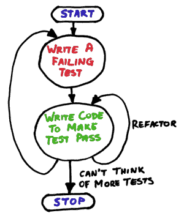

# TDD

---

`Red -> Green -> Refactor (repeat)`

---

# Red
Write a small test.

Run it, watch it fail.

---

# Green
write just enough code to pass this test.

Run it, watch it pass.

---

# Refactor

Remove duplication and clean up.

Run the test to verify that nothing breaks.

---

# How does TDD help us write better code?

---

- Tests describe the code
- Keeps focus on the **subject under test (SUT)**
- Help us write **SOLID** code

---

> “Code without tests is bad code. It doesn't matter how well written it is; it doesn't matter how pretty or object-oriented or well-encapsulated it is. With tests, we can change the behavior of our code quickly and verifiably. Without them, we really don't know if our code is getting better or worse.”

Michael C. Feathers (Working Effectively with Legacy Code)

---

> "TDD is only important if you want your code to work"

Kent Beck

---

# TDD doesn't solve everything

nothing ever does..!

---

# Ratchet

---

---

TDD helps us to keep our focus on a single unit

---

For each unit we pass through TDD.

We can be confident it passes the tests we define

---

It's like using a ratchet to help us take the strain.

---

---

# Let's concentrate on Unit Tests...

---

## What is a unit

a Single unit of "business value"

---

Easy to define a unit when we write a story

---

(XP and TDD were conceived as co-practices.)

---

They _only_ work **really**  well together.

---

# How does TDD promote good architecture?

---

# Focus on the **subject under test**

---

That is don't be concerned with the behavior of dependencies

---

What do we do with dependencies?

---
# Fake the rest...

---

# Test doubles

---

# Tell don't ask

Doesn't work well with people, and sounds nasty.

Don't try this next time you want someone to help you!

---
# Tell don't ask

Does works well for ~~objects~~ machines that operate on protocols

--- 

They should inherently follow our rules

---

When we fake objects we don't have to worry about a class of problems.

(... neither does our **subject under test**)

---

Loose coupling and _helps_ us adhere to S.O.L.I.D

---

# SOLID

---

- **S**ingle responsibility
- **O**pen Closed principle (extensible but not modifyable)
- **L**iskov substitution principle (we can use a substitute without knowing it)
- **I**nversion of control (TDD isn't helping here)
- **D**ependency injection (or here!)

---

A few other principles that TDD helps us with...

---

# DRY

Do Not Repeat Yourself

Every piece of knowledge must have a single unambiguous representation within a system.

---

# Law of Demeter

Objects should assume as little as possible about the structure or properties of anything else.

(very similar to Liskov)

---

# YAGNI

You ain't gonna need it...

Why we only write code that satifies a specification

---

...So we were talking about faking

---

# Types of test double...

- Fakes
- Mocks
- Stubs
- Spies

---

# Fakes

A Fake Object is a simpler implementation of a dependency without side effects
we decide we don't care about.

---

# Fake examples

- Fake database (a set of hash tables that hold enough records for the tests)

- In memory database is a good alternative if we need a more dynamic fake database

- Fake web service - (Homework: also see API contract testing...)

- Fake service layer

- Fake system clock

- Fake hardware devices...

---

# Mocks

- Mock Object implements the same interface as a **subject** dependency.

- When we setup the test, configure the Mock Object with the values which it should respond to the **subject**.

- Also configure method calls (and expected arguments) to expect from the **subject**

- We ensure the Mock Object is used by the **subject** instead of the real implementation (dependency injection is useful here)

---

# Stubs

Stub objects implements the same interface as a **subject** dependency. (deja vu)

---

# Subtle difference between stubs and mocks...

- Mocks themselves are supposed to assert if they were called correctly - not the test

- If they don't do this, they're not Mocks (they're stubs)

---

# Types of stubs...

- Responder

Just respond with a value the **subject** needs (happy path)

- Saboteur

Respond with an invalid value, to help ensure the **subject** will handle it.

- Entity chain snipping ...

A responder that replaces a complex set of objects, usually built for a single test, or a small number of tests.

- Configurable

Refactor hardcoded stubs to provide configuration behavior (they can become mocks)

---

# Spies

A stub which captures the details of a call. It then
goes on to call a real implementation.

- We can use these instead of classic mocks and stubs
- Be careful to ensure that unit tests are not too brittle / use few concrete colaborators (if any)

---

# That's all for now...

---

