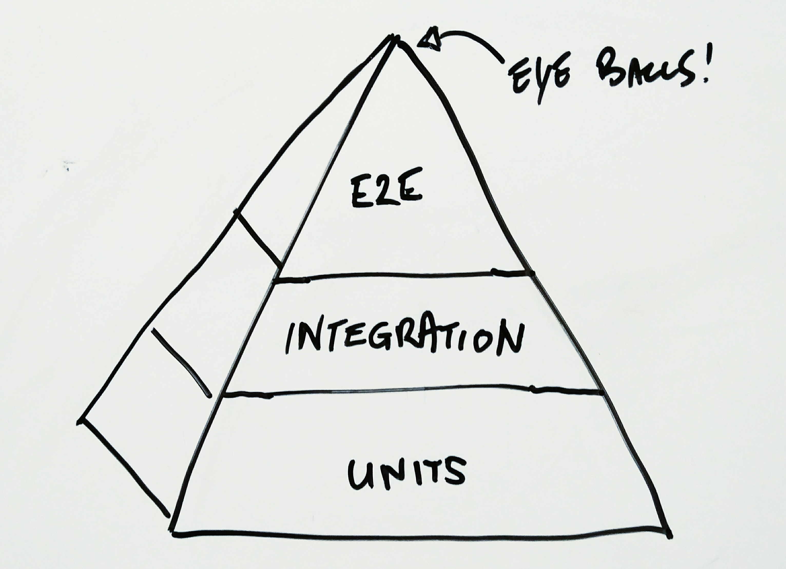

# Why TDD?

---

---

### Testing
### Modularity
### Fewer Bugs
### Less Confusion

---

# Modularity is key!

---

# Why Modular?

- Easy to think about
- Easy to change
- Easy to fix

---

# What makes a good module?

---

# Cohesive

- It's members work to do one thing
- and just one thing
- Makes sense!

---

# Decoupled

- Collaborators are connected by interface
- So they're interchangable
- Keep things loose!

---

# The alternative is pain

- Tight coupling of objects
- More difficult to understand
- Hard to change
- Hard to fix
- Easy to break!

---

# Test First Design

What TDD was originally called. ...I wish we'd stuck with that.

---

# Start with modules

---

# Decoupled by Design

- Only test the subject

---

# Cohesive by Design

---

It has to make sense because your test describes your object.

---

Good tests grow the code and enforce clean design

---

Dependencies / Collaborative objects?

---

# Test Doubles

---

Mocks, Stubs, Fakes, Spies

---

# Mocks grow up!

They can often spawn the new objects they were pretending to be!

---

# Only test what you own

---

# Wrap difficult dependencies

---

# Tell don't ask

Send a message and verify it was sent (using our test double)

---

The unit test shouldn't test what the object doesn't do directly.

---

# Testing Pyramid

---

---

# Integration tests

Cover collaboration of objects and services (fakes)

---

# e2e

Test the full stack

---

# Questions?

---

---

# Thank you!
